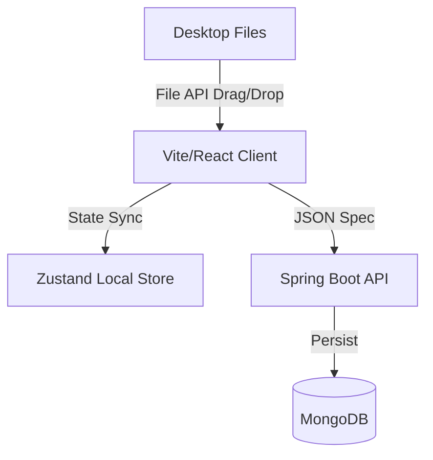

# ⚡️ LUMINA BUILD ⚡️
### *The Cinematic Web Builder for the Gen-Z Visual Economy* 🦄🔮✨

<div align="center">


</div>

---

## 🪐 WHAT IS THIS WITCHCRAFT?

**Lumina Build** is a high-fidelity, Framer/Webflow-tier visual development engine designed for designers who want to ship venture-scale SaaS sites at the speed of thought. No boring gray boxes here. We build **cinematic, neon-drenched, glassmorphic masterpieces** that look like they cost $10,000 to design.

### 🎨 Key Flexes
* **👾 Freeform Physics Canvas**: Drag, drop, scale, and rotate components anywhere in 2D space. Snap layouts, zoom in/out (`Ctrl` + Wheel), and test mobile responsiveness instantly.
* **🦄 Unicorn SaaS Bento-Box Template**: Loaded with an asymmetric modern dark layout featuring floating video preview mockups, glowing border gradients, and glassmorphic bento cards.
* **🚀 Local Drag-and-Drop Media**: Literally drag images/videos off your desktop and drop them anywhere on the canvas. No upload latency. No broken previews. It just works.
* **🎮 Preview Mode**: One click to exit the editor boundaries. Test button navigations, forms, alerts, and pages like a real live site.
* **🪄 Undo/Redo Engine**: Global shortcut stack (`Ctrl + Z` and `Ctrl + Shift + Z`) tracking every single design decision so you never lose your progress.
* **🎹 Keyboard shortcuts**: Press `Delete` or `Backspace` to vaporize components instantly.

---

## 💻 RUNNING LOCALLY (DEV ENGINE)

Get the engine running locally in under 3 minutes. Make sure you have **Node.js** and **Docker** installed.

### ⚡️ Quick Start (Recommended)

1. **Clone & Spin up infrastructure** (DB / API Services):
   ```bash
   docker-compose up -d
   ```

2. **Launch the Frontend**:
   ```bash
   cd frontend
   npm install
   npm run dev
   ```

3. **Launch the Backend**:
   ```bash
   cd backend
   # For Gradle environments
   ./gradlew bootRun
   ```

4. **Access the portal**:
   * **Visual Editor Portal**: `http://localhost:5173`
   * **Backend REST API**: `http://localhost:8080`

---

## 🎨 THE DESIGN STACK

Lumina uses a highly curated design token system:
* **Backgrounds**: Deep obsidian (`#09090b` / `#0a0a0a`) with glowing radial neon meshes.
* **Cards**: Semi-transparent border glassmorphism (`backdrop-filter: blur(30px)`).
* **Typography**: Outfit / Inter font system, heavy tracking and gradient text masking.
* **Micro-interactions**: Powered by `framer-motion` for buttery 120 FPS transitions.

---

## 🛠 TECH SPEC



---
<div align="center">
💅 Developed with absolute vibes on the <code>main</code> branch. Go design the impossible. 💅
</div>
